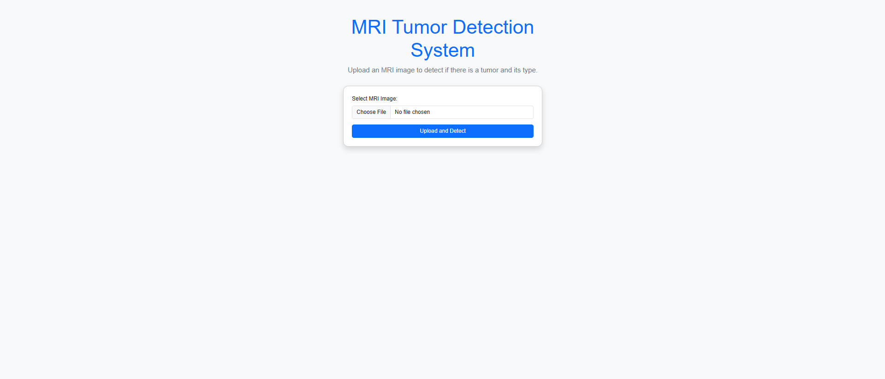
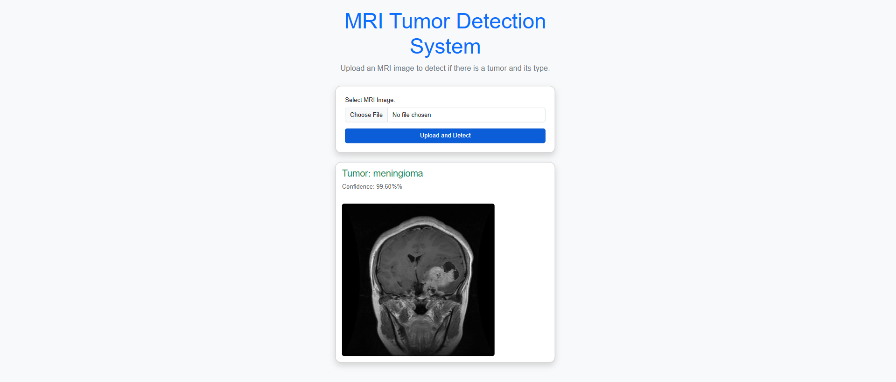
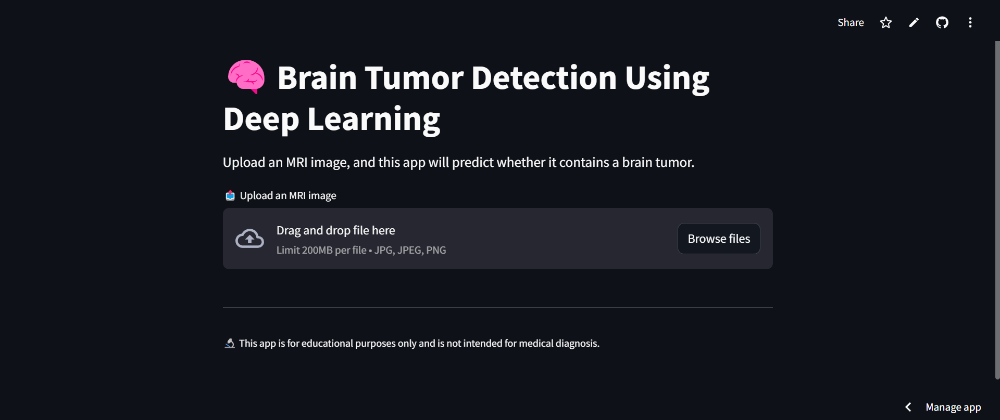
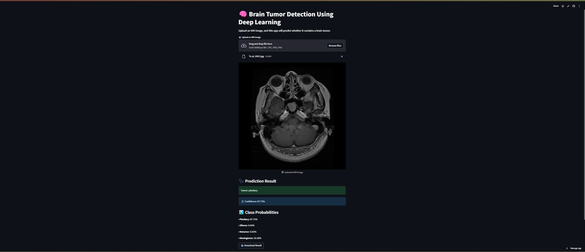

# Brain Tumor Detection Using Deep Learning

This project is a deep learning-powered web application that classifies brain tumors from MRI scans. It supports two interfaces: **Streamlit** and **Flask**, allowing interactive image upload and prediction. The model distinguishes between four tumor types.

---

## Project Highlights

- Upload MRI images in JPG/PNG format  
- Predict tumor type using a trained deep learning model  
- Confidence score output for predictions  
- Saves uploaded files to `Uploads/` directory  
- Dual UI support: Streamlit and Flask  

---

## Tumor Types Detected

- **Glioma**  
- **Meningioma**  
- **Pituitary**  
- **No Tumor**

---

## Model Information

- Framework: **TensorFlow/Keras**
- Architecture: Custom CNN
- Input Image Size: **128x128**
- Model File: `Models/model.h5` *(downloaded automatically)*

> **Note:**  
> The `model.h5` file is **not** included in the local repository. It is hosted on Google Drive and automatically downloaded using `gdown` when the application starts.  
> Ensure `gdown` is installed (`pip install gdown`), and the download command is included in your script.

### Sample `gdown` usage in your script:
```python
import os
import gdown

model_path = 'Models/model.h5'
if not os.path.exists(model_path):
    os.makedirs('Models', exist_ok=True)
    url = 'https://drive.google.com/uc?id=YOUR_FILE_ID'  # Replace with actual file ID
    gdown.download(url, model_path, quiet=False)
```

---

## File & Folder Structure

```
BrainTumorDetection/
├── MRI Images/            # Optional: Dataset
├── Models/                # Model will be downloaded here using gdown
│   └── model.h5 (runtime download)
├── Templates/             # HTML templates for Flask
│   └── index.html
├── Uploads/               # Uploaded MRI image files
├── .gitignore
├── LICENSE
├── README.md              # Project documentation
├── app.py                 # Streamlit interface
├── main.py                # Flask interface
├── requirements.txt       # Python dependencies
├── runtime.txt            # Python version for Streamlit Cloud
```

---

## Getting Started

### Install Requirements

```bash
pip install -r requirements.txt
```

---

### Run with Streamlit

```bash
streamlit run app.py
```

Open your browser and navigate to `http://localhost:8501`

---

### Run with Flask

```bash
python main.py
```

Open your browser and go to `http://127.0.0.1:5000`

---

## Sample UI Screenshot (Flask)

 <!-- Replace with your own image if needed -->

---

## Sample MRI Prediction (Flask)

 <!-- Replace with your own image if needed -->

---


## File Upload Behavior

- Uploaded MRI images are stored inside the `Uploads/` directory.
- Both **Streamlit** and **Flask** versions save uploaded files and display predictions.

---


## Deploy to Streamlit Cloud

> Make sure `runtime.txt` includes:

```
python-3.10
```

Push your code to GitHub, then link it to Streamlit Cloud.

## Sample UI Screenshot (Streamlit)

 <!-- Replace with your own image if needed -->

---

## Project Deployment 

Project Deployment Link [Streamlit Cloud](https://brain-tumor-detection-using-deep-learning-9zmgjsgfeazgnn2yqqt9.streamlit.app/).

---

## Sample MRI Prediction (Streamlit)

 <!-- Replace with your own image if needed -->

---

## Author

**Bhavadharini G**  
M.Tech Data Science, KCT  
[gunasekaranbhavadharini@gmail.com](mailto:gunasekaranbhavadharini@gmail.com)

---

## License

This project is licensed under the MIT License. See the [LICENSE](LICENSE) file for more details.

